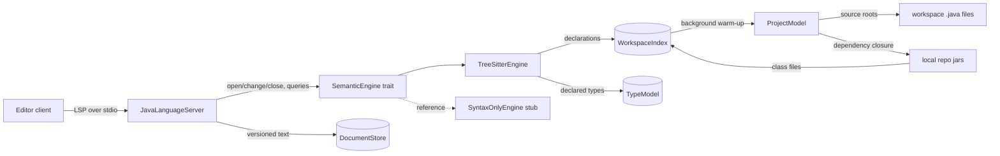

# Architecture

java-lsp is a single cargo crate. A workspace split into shell/engine crates is
deliberately deferred — the `SemanticEngine` trait seam gives the same
isolation until there is a second binary or a second real backend.

## Layout

```
Cargo.toml
Hello.java              — example Java file to open by hand while trying the server
src/
  main.rs     — thin stdio binary: tracing setup (stderr), tokio runtime, tower-lsp server
  lib.rs      — library root so integration tests can drive the shell
  server.rs   — JavaLanguageServer: the LSP shell (all editor-facing handlers)
  document.rs — DocumentStore: URI -> { version, bytes }, incremental text sync
  index.rs    — WorkspaceIndex: workspace-wide symbol entries, background scan
  types.rs    — declared-type model (R7): types, members, hierarchies, binding
  project.rs  — Maven project model: pom discovery, modules, source roots
  resolve.rs  — static Maven dependency resolution (effective poms, closure)
  classfile.rs— minimal jar (ZIP) + class-file reader for dependency indexing
  jdk.rs      — standard-library indexing: JDK discovery, jmods/src.zip/rt.jar
  engine/     — SemanticEngine trait (mod.rs), SyntaxOnlyEngine stub (stub.rs),
                TreeSitterEngine (syntax.rs): parse trees, diagnostics, symbols,
                folding, semantic tokens, completions, navigation, inlay hints
tests/
  harness.rs      — drives JavaLanguageServer through tower_lsp::LspService
  stdio_smoke.rs  — drives the real binary over stdio with raw LSP JSON-RPC
example/          — sample multi-module Maven project (see example/README.md)
zed-java-lsp/           — Zed extension: Java language + tree-sitter-java grammar
                          + java-lsp language server (queries vendored from zed-extensions/java)
```

## Components and data flow



- **LSP shell** (`server.rs`): implements `tower_lsp::LanguageServer`.
  `initialize` advertises incremental text sync, hover, definition,
  completions, document symbols, workspace symbols, folding ranges,
  semantic tokens, references, rename, and inlay hints.
  `didOpen`/`didChange`/`didClose` update the document store, forward the full
  text to the engine, and republish the engine's diagnostics. Query handlers
  dispatch straight through to the engine.
- **DocumentStore** (`document.rs`): keeps UTF-8 bytes per URI with the client
  version. Incremental `TextDocumentContentChangeEvent`s are applied in order;
  LSP positions (line + UTF-16 code units) are converted to byte offsets in the
  store — bytes are what tree-sitter consumes, and UTF-16 conversion is the
  only place position semantics are handled on the way in.
- **SemanticEngine** (`engine/mod.rs`): the seam between the shell and any
  analysis backend — `open`/`change`/`close` plus `diagnostics`, `hover`,
  `definition`, `workspace_symbols`, `completions`, `document_symbols`,
  `folding_ranges`, `semantic_tokens`, `inlay_hints`, and the workspace-index
  hooks `set_workspace_root`, `index_ready`, `indexed_symbols`, all synchronous,
  `Send + Sync`. `references`, `rename`, and `inlay_hints` default to an empty
  result, so a backend without them stays a valid conformance reference. Engines
  without an index get the trait defaults (no-op root, always ready). The
  `SyntaxOnlyEngine` stub (`engine/stub.rs`) is kept as the trait's minimal
  conformance reference; the shell runs the real backend:
- **TreeSitterEngine** (`engine/syntax.rs`): parses each open document with
  `tree-sitter-java` and keeps one tree (plus the text) per URI. Parse errors
  (`ERROR`/missing nodes) become error diagnostics, so squiggles appear on
  broken code and clear on fix. Declaration nodes become hierarchical
  document symbols (class/interface/enum/record/constructor/method/field);
  declarations and brace blocks spanning multiple lines become folding
  ranges; a curated node-kind mapping produces delta-encoded semantic tokens
  (declaration names, types, strings, comments, numbers — legend exported as
  `SEMANTIC_TOKEN_TYPES` for the shell's capability). Point columns from
  tree-sitter are byte-based and converted to UTF-16 at the LSP boundary.
  Completions merge three ranked sources as `sort_text` prefixes `0`/`1`/`2`
  (clients re-sort alphabetically): Java keywords; names in scope at the
  cursor from the open document's tree — the innermost enclosing
  method/constructor's parameters and locals plus the enclosing type's fields
  (nameable unqualified, so no wrong membership is claimed); and workspace
  index symbols matched by `query_prefix` on the simple name, with members
  labeled `Container.name` but inserted/filtered under their simple name.
  Symbols that share a simple name but are imported differently stay separate
  items — each carrying its own import edit and labeled with its owner
  (`class of java.awt` alongside `interface of java.util`) — while entries for
  one symbol, or a name with the same import, collapse to one. The index query
  takes only a brief read
  lock, so while the workspace scan is warming up completions simply contribute
  whatever is indexed so far — partial, never blocking (R6). Member access is
  answered from the type layer (see the `types.rs` bullet): the receiver's type
  is inferred and its members are offered with their signatures as `detail`
  (inherited members included for workspace types), while an uninferrable
  receiver still returns an empty list, claiming nothing a type-free engine
  cannot verify.
  Auto-import: every index-sourced item whose symbol lives outside the open
  file's package carries an `additionalTextEdits` inserting
  `import <fqcn>;` (after the last import, else after the `package`
  statement, else at the top); the index stores each entry's package so the
  fully qualified name is known at completion time. The never-worsen rules
  suppress the edit when the name already resolves — same file, same
  package, an equal explicit import, a matching `.*` wildcard — or when it
  would conflict (the simple name already imported from another package, or
  declared in the file's own package); a suppressed edit leaves the plain
  insert text, never a compile error. Keywords and locals never carry
  edits, and jar members import their enclosing type.
  Navigation works off the same index. Definition resolves the full word
  under the cursor: inside an import declaration the dotted path's last
  segment is looked up (a `.*` wildcard or an unindexed JDK/library import
  honestly yields nothing; a `static` import also admits method/field
  targets); otherwise an exact-name lookup over declaration entries is
  narrowed by the node kind at the cursor — a `type_identifier` restricts to
  type declarations, a method-invocation or field-access name to methods and
  fields. A single candidate — or several sharing one file (method overloads,
  same-file repeats), resolved to the first by position — is an answer;
  anything spread across multiple files returns no location rather than a
  wrong one (no result beats a wrong result). `workspace_symbols` maps
  `query_prefix` matches to `SymbolInformation` — import entries excluded,
  the innermost container as `container_name`, the selection range as the
  location — with an empty query returning everything indexed for the client
  to filter. Like completions, both serve partial results during warm-up and
  never block (R6). **Hover** resolves the symbol under the cursor through the
  type layer and renders its declaration as Markdown — a member's signature, a
  type's declaration, or a local's declared type — returning nothing when the
  symbol is unresolved or ambiguous. Documented v1 limitations: `definition`
  is still a pure name lookup with no receiver-type resolution, so `x.foo()`
  may hit a same- or cross-file declaration of `foo` by name or return nothing;
  and scanned-file ranges reflect the last disk scan, not a live watcher.
  **References and rename** resolve the symbol under the cursor the way hover
  does — a member's declaring type coming from the receiver's type, identified
  by simple name *and* package so a same-named type elsewhere is never touched —
  and then search the workspace's `.java` files (each pre-filtered by a
  substring check before being parsed, on demand, on the request path) for
  occurrences that can be attributed with confidence: a type only in files that
  can see it (its own file, its package, an import, or a fully-qualified use), a
  member access only where the receiver's type resolves the name back to the
  same declaring type, an unqualified member name only inside the declaring
  type's own span, and a local only inside its method and only when that method
  declares the name once. A declaration is reported only when
  `include_declaration` asks for it: the search skips declaration names, and the
  index (or, for a local, its own recorded location) supplies them. A cursor on
  a non-terminal segment of an import path targets nothing. `rename` builds one
  `TextEdit` per reference and **refuses** (`null`) otherwise — an unresolved or
  ambiguous target, a library declaration, an invalid identifier, or a search
  that could not read and parse every candidate file.
  Trees are rebuilt from the full text per edit — one file per change, never
  the workspace; `InputEdit`-based incremental reparsing (needs edit ranges
  forwarded from the shell) is a later optimization.
- **Type layer** (`types.rs`): the pure-Rust engine chosen for R7. It models
  declared types — primitives, `void`, `null`, arrays, named references with
  their generic arguments kept as written, and type variables — and keeps each
  type's package, kind, supertypes (`extends`/`implements`), fields, and
  methods with their declared types (source-declared methods also keep their
  parameter names, which class-file descriptors cannot supply). The model is
  built in two layers during
  warm-up: source files contribute full `TypeInfo`s (member types and
  supertypes) from the trees the scan already parses, and the resolved jars and
  JDK contribute `TypeInfo`s with real signatures and supertypes, parsed from
  their class files (or, for a source-only JDK, from `lib/src.zip` through the
  same tree-sitter extractor). Member
  lookup walks supertypes breadth-first, cycle-guarded, first declaration
  winning, so inherited members are found.
  **Binding** turns a cursor position into an answer: it collects the names
  visible there (locals and parameters with their declared types, the enclosing
  type's fields, type parameters, imports including `.*`, and the file's
  package) and then resolves a simple name in Java's precedence order, or
  infers the type of a `.`-receiver (`identifier`, `this`/`super`, `new T(...)`,
  and chained field/method access). Everything the layer cannot pin to a single
  answer is `Unknown`, and callers treat that as "no answer".
  **Semantic diagnostics** flag a simple type name in a declaration, `new`,
  cast, `extends`, or `implements` that resolves nowhere — but only when the
  model actually vouches for `java.lang` (an indexed JDK), and only for files
  that parse cleanly, so neither a missing JDK nor a missing dependency turns
  into a wall of false positives. Qualified names, generic arguments, `var`,
  and type parameters are left alone rather than guessed at.
  Known approximations, documented rather than hidden: a simple type name
  resolves in Java's order — an exact single-type import, the file's own
  package, a wildcard import, then a unique model match — so a name shared
  across packages (e.g. `java.util.List` vs `java.awt.List`) is resolved only
  when the file pins it down; a nested type is keyed by its innermost simple
  name with its enclosing chain recorded (so two `Inner`s in one package
  coexist rather than overwrite each other), and a class file's `Outer$Inner`
  descriptor reaches it as `Inner`; a qualified reference, and a supertype, are
  looked up in the package the name carries, so a class-file base whose simple
  name is shared across packages still resolves; a call's type arguments are
  inferred from its arguments (a method's own type parameters and the
  receiver's, with primitives boxed) and substituted into the result, while a
  call the layer cannot pin down keeps the written form; overloads are chosen by
  arity at a call site and by name alone elsewhere; and the implicit
  `java.lang.Object` is not recorded as a supertype (matching source-extracted
  types), so its members are offered only where a type extends it explicitly.
  The semantic diagnostic is deliberately narrow so it never cries wolf: it
  checks a bare simple type name in a declaration, `new`, a cast, `extends`, or
  `implements` only, and treats a name the model knows in *any* package as
  resolved, so it under-reports rather than risk a false positive on a name it
  cannot fully reason about. Overload resolution by argument
  types, lambdas, casts, and static-import member resolution
  remain follow-up work (R7 remainder, R8).
- **Inlay hints** (`engine/syntax.rs`, R9): computed on demand for the range
  the client requests — the tree walk is pruned to that range, so cost scales
  with the visible text rather than the file. Three families: variable type
  hints (`: Type` after a local or field name), parameter name hints at a call
  site (`name:` before an argument), and chained-call hints (the return type of
  each intermediate link — an invocation immediately dereferenced by a further
  `.field`/`.method()` — while the outermost call and standalone calls are left
  alone). A local declared with `var` has its initializer's type inferred
  through `receiver_type` — including a call's type arguments, so
  `List.of(5)` is `List<Integer>` — and that inference also feeds the scope, so a
  `var` local completes and hovers like an explicitly typed one. Parameter names
  come from the type model: source-declared methods keep them (each `Member`
  parameter carries a name and a type) and the overload matching the call's
  arity is chosen, so class-file members — every jar/JDK method
  indexed from bytecode — have name-less parameters and therefore produce no
  parameter hint, and a call whose argument count matches no overload gets no
  parameter hint rather than the wrong names. Conservative as everywhere: an
  unresolved type or callee yields no hint, and only hints whose position lies
  inside the requested range are returned, so a node straddling the range
  boundary cannot leak a hint outside it. No `inlayHint/resolve` and no
  server-push refresh; a hint
  computed while the model is still warming simply appears on the client's next
  request (R6).
- **WorkspaceIndex** (`index.rs`): a workspace-wide, in-memory index of Java
  declarations and imports, owned by `TreeSitterEngine`. Entries are flat
  `SymbolEntry`s (name, kind, package, enclosing-type container chain,
  ranges, `dependency` flag) — no trees, no text — so memory stays
  proportional to workspace size. The package (from the file's
  `package_declaration`, or the class's internal name for jars) is what
  lets completions auto-import accepted symbols. The shell captures `rootUri` (or the first workspace
  folder) in `initialize` and hands it to the engine in `initialized`; the
  engine spawns the warm-up onto tokio's blocking pool: build the project
  model, scan the source roots (or the whole root for non-Maven workspaces)
  for `*.java`, resolve each module's dependency closure, and index the
  resolved jars — the request path is never involved (R6). The same pass also
  builds the declared-type model (`types.rs`), which the engine holds alongside
  the index. Edits to open
  documents re-extract that file's entries from its already parsed tree; on
  `didClose`, a file inside any source root is re-read from disk (disk truth
  wins), anything else drops its entries. `index_ready()` flips when warm-up
  completes so index-backed features can report themselves briefly
  unavailable during warm-up instead of blocking; completions consume the
  index via `query_prefix` (see the `TreeSitterEngine` bullet above), and
  go-to-definition and `workspace/symbol` are backed by the same two lookups
  — `query_name` for exact-name definition targets, `query_prefix` for
  workspace symbols — with dependency-jar entries filtered out of both (see
  the project-model bullet). Known v1 limitations: there is no file watcher,
  so out-of-editor disk changes are picked up on close re-reads only, and a
  scanned file's indexed ranges reflect the last disk scan.
- **Maven project model** (`project.rs` + `resolve.rs` + `classfile.rs`):
  the warm-up builds a model of the workspace before scanning it. POM
  discovery walks the root (hidden dirs, `target/`, `build/` skipped) and
  every `pom.xml` becomes a module whose source roots are the standard
  `src/main/java`/`src/test/java` unless `<build>` overrides them; roots that
  don't exist are dropped, and a workspace with no poms falls back to
  scanning the whole root (non-Maven projects keep working).
  **Dependency resolution** (`resolve.rs`) is static and strictly offline —
  it reads the local repository (`$MAVEN_REPO` if set, else
  `~/.m2/repository`) and never invokes `mvn` or the network. Each pom is
  assembled into an effective model (parent chain via `relativePath` or the
  repository, `${...}` interpolation with the `project.*` built-ins,
  parent-first merge; unknown properties interpolate to nothing and the
  artifact is pruned with a warning). `dependencyManagement` merges down the
  parent chain (child wins) and expands `import`-scoped BOMs from the
  repository (direct management beats imported, first imported wins among
  BOMs). The dependency closure is a breadth-first walk over each artifact's
  effective pom with Maven's mediation — nearest depth wins, first
  declaration wins at equal depth (implemented as first-encountered-in-BFS) —
  path-scoped exclusions, and optional/test transitive pruning; a missing
  pom prunes its branch with a warning while the rest of the closure
  continues. Resolved jars are parsed by a minimal ZIP reader (central
  directory, STORED/DEFLATE via `flate2`) and class-file parser (constant
  pool, access flags, member tables with each member's descriptor type, plus
  the superclass and interfaces), producing
  index entries flagged `dependency: true`: offered in completions with the
  usual `Container.name` labels, but excluded from definition and
  `workspace/symbol`, since jar locations cannot be opened by an editor (no
  result beats a wrong result). Known v1 limitations: no profile activation,
  no plugin-contributed roots or dependencies, no transitive version-range
  handling, `-SNAPSHOT` metadata is ignored (the local file is used as-is),
  and dependency scopes are ignored at indexing time (test-scope types may
  be offered in main sources). The bench's `--maven` mode measures open-to-
  responsive on a Maven-layout fixture.
- **Standard library** (`jdk.rs`): the installed JDK's `java.*`/`javax.*`
  declarations are indexed during warm-up, right after dependency jars, and
  flow through the same dependency path — offered in completions with
  auto-import edits, filtered out of definition and `workspace/symbol`.
  Discovery order: `$JAVA_LSP_JDK` (an explicit override pointing at an
  unusable home disables JDK indexing entirely — deterministic opt-out),
  `$JAVA_HOME`, then common locations including SDKMAN's
  `~/.sdkman/candidates/java/current`. Three archive layouts are supported:
  `jmods/*.jmod` class files (JDK 9+, ZIPs with a magic prefix — the
  tail-scanning reader handles that), `lib/src.zip` sources (tree-sitter
  parsed; some distributions ship sources without jmods), and `rt.jar`
  (JDK 8). Only class/source entries under `java.*`/`javax.*` are indexed —
  `jdk.*`, `com.sun.*`, `sun.*`, `module-info`, and `package-info` stay out —
  and archives are read with a streaming per-entry callback so multi-
  hundred-megabyte content never materializes at once. `java.lang.*` symbols
  never carry an import edit (implicitly imported in Java). No JDK found is
  a graceful no-op. Measured impact (Temurin 25, src.zip, ~4.2k files):
  warm-up ≈ 5.5 s and peak RSS ≈ 165 MB in release — both on the background
  task; hover RTT during warm-up stayed ≤ 1.6 ms (R6 holds; see the bench
  baseline in the changelog).

## Decisions and constraints

- **`tower-lsp` over stdio** — ergonomics first (decision recorded in
  `requirements.md`); revisit if it blocks cancellation or backpressure control.
- **Process lifecycle**: `shutdown`/`exit` stop the service (further requests
  are rejected with `ExitedError`); the process itself terminates when the
  client closes stdin (EOF), which is tower-lsp's transport semantics and what
  every editor does after `exit`.
- **Method params are validated**: sending a `params` field for methods that
  take none (`shutdown`, `exit`) is rejected with -32602 — clients and tests
  must omit the field entirely.
- **Logging goes to stderr.** stdout is the LSP transport; any stray stdout
  write corrupts the protocol. `tracing-subscriber` writes to
  `std::io::stderr`, filtered by `RUST_LOG` (default `java_lsp=info`).
- **`rename` returns a plain `changes` edit.** The shell tracks versions only
  for open documents, so a versioned `documentChanges` edit covering unopened
  files would claim a guarantee the server cannot make; a rename applies to the
  on-disk content the scan read. Edits to open documents are still subject to
  the client's own version checks.
- **Out-of-range change positions** are skipped (with a warning) rather than
  failing the whole `didChange` batch; the document keeps its last good text.
- **Test harnesses must drain the client socket**: tower-lsp's client channel
  has capacity 1, so a test that triggers more than a couple of
  `publishDiagnostics` notifications without reading the `ClientSocket`
  blocks the server's handlers (seen with the workspace-index integration
  test; it now drains the socket in a spawned task).

## Zed integration

`zed-java-lsp/` is a self-contained Zed extension (`zed_extension_api` 0.7,
compiled to `wasm32-wasip2`): it registers the `tree-sitter-java` grammar and
the Java language (config + highlighting/indent/fold/outline/bracket/textobject
queries, vendored from `zed-extensions/java`) and starts `java-lsp` as the
language server — no JDK, no jdtls. It downloads nothing:
`language_server_command` resolves the binary in order — user override
(`lsp."java-lsp".binary.path`), `$PATH` lookup, or the repository's own
`target/release` (then `target/debug`) build — testing host paths through
`sh -c '[ -f ... ]'` because the WASM sandbox cannot stat them directly — and
errors with build/install instructions otherwise. Install it as a dev
extension via `zed: install dev extension`; see `zed-java-lsp/README.md`.

## Verifying without an editor

Two harnesses drive the server with raw JSON-RPC, both plain `cargo test`:

- `tests/harness.rs` feeds requests through `tower_lsp::LspService` and asserts
  on responses and document-store state.
- `tests/stdio_smoke.rs` spawns the built binary (via
  `CARGO_BIN_EXE_java-lsp`) and drives the real stdio transport through
  initialize → didOpen → didChange → hover → shutdown → exit. Note: methods
  without params in the LSP spec (`shutdown`, `exit`) must be sent without a
  `params` field — tower-lsp rejects `{}` with -32602.
- `src/bin/java-lsp-bench.rs` is the performance harness (see
  `docs/dev/backlog/perf-benchmarks.md`): one command —
  `cargo run --release --bin java-lsp-bench -- --files 500
  --methods-per-class 10` — generates a fixture Java workspace in a temp dir,
  spawns the real `java-lsp` binary (resolved from `--server`, `$JAVA_LSP_BIN`,
  then `target/{release,debug}/java-lsp`, with an auto `cargo build --bin
  java-lsp` when run under cargo), and drives it over raw stdio JSON-RPC. It
  measures per-feature first-response time after `didOpen`, hover RTT sampled
  on a 25 ms tick during index warm-up (detected via the server's own
  "workspace index warm-up complete" log line on stderr), and peak RSS from
  `/proc/<pid>/status` `VmHWM`, then prints a text table (or `--json`) and
  cleans up (unless `--keep`). Other flags: `--fields-per-class F`. Baselines
  are recorded per milestone in `docs/dev/changelog.md`.
