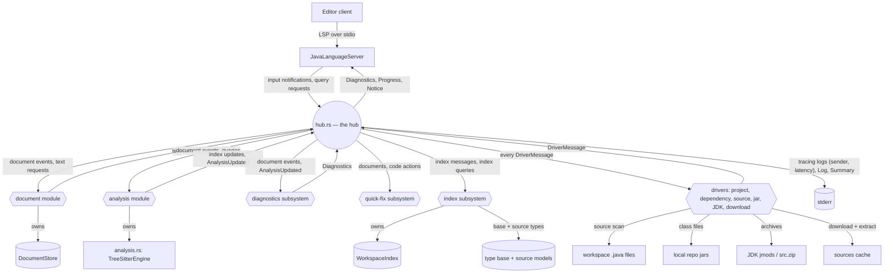

# Architecture

java-lsp is a single cargo crate. A workspace split into shell/engine crates is
deliberately deferred — the shell is already just another client on the engine
hub (notifications and requests out, notifications in), so a future split is a
transport change rather than a redesign.

## Layout

```
Cargo.toml
Hello.java              — example Java file to open by hand while trying the server
src/
  main.rs     — thin stdio binary: tracing setup (stderr), tokio runtime, tower-lsp server
  lib.rs      — library root so integration tests can drive the shell; the
                analysis threads' stack size (RUNTIME_STACK_SIZE)
  server.rs   — JavaLanguageServer: the LSP shell (all editor-facing handlers),
                a hub client that renders diagnostics, progress, and notices
  document.rs — the document module: DocumentStore (URI -> { version, bytes },
                incremental text sync) and its hub client thread
  index.rs    — the index subsystem: WorkspaceIndex (workspace symbol entries
                and the append-only declared-type base) and IndexHandle, the
                message-based handle whose thread owns the index
  scan.rs     — the source-scanner driver: parses the project's `.java` files
                into the index (the `Sources` stage)
  jars.rs     — the dependency-jar indexer driver: parses resolved jars into
                the index (the `Jars` stage)
  base_cache.rs — the cross-run cache of the class-file base (jars, JDK): one
                guarded file per archive, read on demand
  hub.rs      — the engine hub: HubClient (notify, subscribe/serve, and
                hub-routed requests answered as an awaitable Reply) and the hub
                thread that broadcasts notifications, routes requests, and logs
  types.rs    — declared-type model (R7): types, members, hierarchies, binding
  project.rs  — Maven project model (pom discovery, modules, source roots) and
                the project driver: walks the model + inventory and coordinates
                `ready` and the summary
  resolve.rs  — static Maven dependency resolution (effective poms, closure)
                and the dependency driver
  classfile.rs— minimal jar (ZIP) + class-file reader for dependency indexing
  jdk.rs      — standard-library indexing (JDK discovery, jmods/src.zip/rt.jar)
                and the JDK indexer driver
  sources.rs  — dependency sources: fetches -sources.jar, extracts, and
                publishes them through the hub; the source downloader driver
  messages.rs — the hub vocabulary: the DriverMessage notifications, the
                Request variants (AnalysisRequest for the editor's queries),
                and the reply handle
  engine.rs   — the one setup path (`start`: the hub plus every participant's
                `spawn`, the shell included)
  diagnostics.rs — the diagnostics subsystem: its own parser and open-document
                state, computing syntax and unresolved-symbol diagnostics and
                reporting them to the hub, plus a queryable cache of the latest
                pass per open document
  quickfix.rs — the quick-fix subsystem: its own parser and open-document text,
                generating the create/import/rename fixes from the symbol index
                and the diagnostics cache
  analysis.rs — the engine core (TreeSitterEngine): parse trees, symbols,
                folding, semantic tokens, completions, navigation, inlay hints;
                and the analysis module that owns it on the hub
tests/
  harness.rs      — drives JavaLanguageServer through tower_lsp::LspService
  stdio_smoke.rs  — drives the real binary over stdio with raw LSP JSON-RPC
example/          — sample multi-module Maven project (see example/README.md)
zed-java-lsp/           — Zed extension: Java language + tree-sitter-java grammar
                          + java-lsp language server (queries vendored from zed-extensions/java)
```

## Components and data flow


```mermaid
graph TD
    C[Editor client] -- LSP over stdio --> S[JavaLanguageServer]

    S -- "input notifications, query requests" --> HUB(("hub.rs — the hub"))
    HUB -- "Diagnostics, Progress, Notice" --> S

    HUB -- "document events, text requests" --> DOC{{document module}}
    DOC -- owns --> D[(DocumentStore)]
    DOC -- "text" --> HUB

    HUB -- "document events, queries" --> AN{{analysis module}}
    AN -- "index updates, AnalysisUpdated" --> HUB
    AN -- owns --> TS[analysis.rs: TreeSitterEngine]

    HUB -- "document events, AnalysisUpdated" --> DSUB{{diagnostics subsystem}}
    DSUB -- Diagnostics --> HUB

    HUB -- "documents, code actions" --> QF{{quick-fix subsystem}}

    HUB -- "index messages, index queries" --> IDX{{index subsystem}}
    IDX -- owns --> WI[(WorkspaceIndex)]
    IDX -- "base + source types" --> TL[(type base + source models)]

    HUB -- "every DriverMessage" --> DR{{drivers: project, dependency, source, jar, JDK, download}}
    DR -- DriverMessage --> HUB
    DR -- "source scan" --> WS[workspace .java files]
    DR -- "class files" --> JV[local repo jars]
    DR -- "archives" --> ARCH[JDK jmods / src.zip]
    DR -- "download + extract" --> SR[sources cache]

    HUB -- "tracing logs (sender, latency), Log, Summary" --> E[(stderr)]
```

**Hub and spoke.** The hub is the single **hub**; every component attached to it — the LSP shell included — is a **spoke**, a hub client that talks only to the hub and never to another spoke directly. A spoke **notifies** (a broadcast to every subscriber) or **requests** (routed to exactly one owning module and answered as an awaitable `Reply`), and every notification, request, reply, and log line passes through the hub. The shell is the only spoke that knows about the editor; the hub carries no editor knowledge. `messages.rs` holds the hub vocabulary — the `DriverMessage` notifications and the `Request` variants — that every spoke speaks.

| Module                                                                                       | Description                                                                                                     | Responsibilities                                                                                                                                                                                                                                                                                                                                                                                                                                   |
| -------------------------------------------------------------------------------------------- | --------------------------------------------------------------------------------------------------------------- | -------------------------------------------------------------------------------------------------------------------------------------------------------------------------------------------------------------------------------------------------------------------------------------------------------------------------------------------------------------------------------------------------------------------------------------------------- |
| **Hub** (`hub.rs`)                                                                           | The engine's central mediator — the hub of the hub-and-spoke.                                                   | Owns the FIFO inbound channel; broadcasts notifications to every subscriber; routes each request to its owner and returns the reply; logs and times every message (`debug`/`trace`) and renders the `Log`/`Summary` lines. Carries no editor knowledge.                                                                                                                                                                                            |
| **LSP shell** (`server.rs`)                                                                  | The `tower_lsp::LanguageServer` implementation — a hub client like any other, never touching the core directly. | Serves every editor-facing method; advertises capabilities in `initialize`; notifies input (`FolderAdded`, `ClientCapabilities`, `DocumentOpened`/`DocumentChanged`/`DocumentClosed`, `FileEvent`); requests queries; renders `Diagnostics`, `Progress` (as `$/progress`), and `Notice` (as `window/showMessage`) on its own drain task. Its hub channel is unbounded, so a slow client never stalls the hub.                                      |
| **Document module / DocumentStore** (`document.rs`)                                          | The canonical document store — a hub client, not owned by the shell.                                            | Subscribes to `DocumentOpened`/`DocumentClosed`; applies the editor's incremental changes on a `DocumentChange` request and returns the new text (`None` when not open); answers `DocumentText`; converts LSP positions (line + UTF-16 code units) to byte offsets — the only place position semantics are handled on the way in.                                                                                                                  |
| **Engine wiring** (`engine.rs`)                                                              | The single `start` path that builds the hub and boots every participant.                                        | Calls each participant's `spawn` — shell first, then modules, then drivers — each of which labels itself, registers (`subscribe` for notifications, `serve` for requests), and starts its own thread or task. Pure wiring: no channel, label, or receive loop.                                                                                                                                                                                     |
| **Analysis module / engine core** (`analysis.rs`, `TreeSitterEngine`)                        | Owns the open documents' parse trees and answers the shell's queries.                                           | Parses each open document with `tree-sitter-java`; serves document symbols, folding ranges, semantic tokens, completions, hover, definition/declaration, implementation, references, rename, and inlay hints; applies editor input inline in arrival order and runs each query on the blocking pool, so a slow search never delays typing; notifies `AnalysisUpdated` after each applied document or file event (it does not compute diagnostics). |
| **Type layer** (`types.rs`)                                                                  | The pure-Rust declared-type model (R7).                                                                         | Models types, members, hierarchies, generics, records, enums, and syntactically-read Lombok members; infers receiver types; resolves names in Java precedence order; selects overloads by argument types. Backs completion, hover, signature help, inlay hints, and semantic diagnostics through a cached, layered, dirty-overlay view of the base and per-source models.                                                                          |
| **Diagnostics subsystem** (`diagnostics.rs`)                                                 | A self-contained parser and open-document state, separate from the core.                                        | Sweeps on `AnalysisUpdated` (the just-edited file first, then every open document) for syntax errors and unresolved symbols; reads the index and type layer through `IndexHandle` with per-sweep caches; publishes one `Diagnostics` per open document and keeps a queryable cache of each document's latest pass.                                                                                                                                 |
| **Quick-fix subsystem** (`quickfix.rs`)                                                      | A self-contained parser and open-document text.                                                                 | Turns unresolved-symbol diagnostics into `CodeAction`s — add an import, change to a near member, or create a stub type/member; reads the symbol index (`IndexHandle`) and the diagnostics cache (`DiagnosticsForDocument`); answers the shell's `codeAction` request as an awaited hub request.                                                                                                                                                    |
| **Index subsystem / WorkspaceIndex** (`index.rs`)                                            | A workspace-wide in-memory symbol index owned by a dedicated thread.                                            | Stores flat `SymbolEntry`s (name, kind, package, container chain, ranges, `dependency`/`synthetic` flags); answers `query_name`/`query_prefix`/`query_names`/`has_packages` through the message-based `IndexHandle`; re-extracts a file's entries on edits and watcher events (and re-reads disk on `didClose`); grows the declared-type base append-only, one layer per artifact.                                                                 |
| **Maven project model & dependency resolution** (`project.rs`, `resolve.rs`, `classfile.rs`) | The project driver's model of the workspace and its strictly offline dependency resolver.                       | Walks the root on `FolderAdded` and discovers `pom.xml` modules and source roots (falling back to scanning the whole root); resolves the jar closure from the local repository with Maven mediation, never invoking `mvn` or the network; parses jars and class files into `dependency` index entries; coordinates `ready` and the warm-up summary.                                                                                                |
| **JDK indexer** (`jdk.rs`)                                                                   | Indexes the installed JDK's standard library.                                                                   | Discovers the JDK (`$JAVA_LSP_JDK`, `$JAVA_HOME`, common locations incl. SDKMAN) and indexes `jmods/*.jmod`, `lib/src.zip`, or `rt.jar` with streaming per-entry reads; keeps only `java.*`/`javax.*`; a missing JDK is a graceful no-op.                                                                                                                                                                                                          |
| **Dependency sources** (`sources.rs`)                                                        | Fetches and indexes `-sources.jar` for resolved artifacts.                                                      | Reuses local sources or downloads from Maven Central with bounded concurrency and `.sha1` verification; extracts under the sources cache; republishes source-backed dependency entries (real signatures and ranges), dropping the class-derived ones; disabled by `$JAVA_LSP_OFFLINE`.                                                                                                                                                             |
| **Source scanner & jar indexer** (`scan.rs`, `jars.rs`)                                      | Warm-up drivers that fill the index.                                                                            | The source scanner parses the project's `.java` files into the index (`Sources` stage); the jar indexer parses resolved jars into it (`Jars` stage). Both speak only `DriverMessage`s.                                                                                                                                                                                                                                                             |

## Implementation notes

Detailed behaviour, edge cases, and the documented v1 limitations behind each module in the table above.

Every arrow into or out of the hub is a hub message: the analysis, diagnostics,
and quick-fix modules also read the index (and the quick-fix module the
diagnostics cache) through hub-routed requests.

- **LSP shell** (`server.rs`): implements `tower_lsp::LanguageServer`.
  `initialize` advertises incremental text sync, hover, definition,
  declaration, implementation, completions, signature help, document symbols, workspace
  symbols, folding
  ranges, semantic tokens, references, rename, code actions (kind `quickfix`),
  and inlay hints.
  `didOpen`/`didChange`/`didClose` notify the hub
  (`DocumentOpened`/`DocumentChanged`/`DocumentClosed`, the full text shared
  behind an `Arc`); `didChange` first asks the document module for the new text,
  since the shell holds no store; the diagnostics come back as `Diagnostics`
  notifications on the shell's own hub channel, which the shell's drain task
  publishes. `initialized` also registers
  `workspace/didChangeWatchedFiles` for `**/*.java` when the client advertises
  `workspace.didChangeWatchedFiles.dynamicRegistration` — a fire-and-forget
  `client/registerCapability`, so the handshake never waits on the client — and
  the `didChangeWatchedFiles` handler notifies one `FileEvent` per
  created/changed/deleted file; without the capability the watcher is simply
  skipped and everything else stands (D6).
  Query handlers await their hub request's `Reply`. That
  same drain task renders the `Progress` notifications as
  `window/workDoneProgress/create` plus `$/progress` — one status-bar item
  titled `java-lsp`, whose message names the current phase and whose percentage
  rises during the source download — and each `Notice` as a single
  `window/showMessage`. Progress and notices are gated on the client having
  advertised `window.workDoneProgress` in `initialize`; without it they are
  dropped silently. A `window/workDoneProgress/cancel` is ignored — the
  background job is not cancellable.
- **Document module** (`document.rs`): owns the canonical `DocumentStore`, a hub
  client like any other — the shell holds no document state. It keeps UTF-8 bytes
  per URI with the client version, subscribes to `DocumentOpened`/`DocumentClosed`,
  and applies the editor's incremental `TextDocumentContentChangeEvent`s in order
  when the shell sends a `DocumentChange` request, returning the new text; a
  `DocumentText` request returns the current text and version. LSP positions
  (line + UTF-16 code units) are converted to byte offsets here — bytes are what
  tree-sitter consumes, and UTF-16 conversion is the only place position semantics
  are handled on the way in.
- **The shell on the hub** (`server.rs`, `engine.rs`, `analysis.rs`): the shell
  never touches the core directly — it is just another hub client.
  `engine::start` (the `LspService` constructor) starts the hub and calls each
  participant's `spawn`: the shell first, then the modules, then the drivers.
  Each `spawn` labels itself, registers — `subscribe()` for every notification,
  `serve(Module)` to also own a module's requests — and starts its own thread or
  task, so `engine.rs` is pure wiring (no channel, no label, no receive loop) and
  the shell's client logs as `server`. The shell
  **notifies** the editor's input — `FolderAdded` (the root, in
  `initialized`), `ClientCapabilities`, `DocumentOpened`/`DocumentChanged`/
  `DocumentClosed`, and `FileEvent` — and **requests** each query as a
  `Request::Analysis(AnalysisRequest::…)`, which the hub routes to the
  **analysis module**; code actions go to the quick-fix module. Every
  `HubClient` request returns a `Reply` — a thin wrapper over a `tokio` oneshot
  receiver. A query handler awaits it, so no runtime worker blocks; the
  synchronous module code (the core, diagnostics, quick-fix), which runs on its
  own threads or the blocking pool, calls `Reply::blocking_recv` instead. The
  analysis module is a thread that owns the core and
  applies the editor's notifications **inline, in arrival order**: one sender, a
  FIFO hub, and a FIFO module channel mean an edit always lands before the query
  the client sends at the new cursor. It hands each query to the runtime's
  **blocking pool**, so a slow `references` never delays typing. It does **not**
  compute diagnostics: after applying a document or file event (and sending the
  index the core's updates) it notifies `AnalysisUpdated`, and the **diagnostics
  subsystem** sweeps on that, so an edit and the queries that follow it are never
  queued behind a sweep, while the sweep still reads an index that holds the edit.
  Each pass covers **every** open document, the just-edited one first, so a
  referring file's squiggles clear without an edit of its own (D3); a close
  clears the closed document with an empty `Diagnostics` and republishes the rest.
  From the background warm-up come `Progress(ProgressUpdate)` (begin/update/end
  with a phase message, a count, and an optional download percentage) and
  `Notice { level, text }` notifications, which the shell renders, and `Log` and
  `Summary`, which the hub renders as `tracing` lines — the hub carries no editor
  knowledge. The shell's hub channel is unbounded, so a slow client can never
  stall the hub. A dropped reply — the module gone — yields the empty result
  rather than an error. The core itself:
- **Diagnostics subsystem** (`diagnostics.rs`): owns a `tree-sitter-java` parser
  and the open documents' text, parses each open buffer itself, and computes the
  pass — syntax errors, or the unresolved-symbol checks — reading the workspace
  symbol index and declared-type layer from the **index subsystem** through
  `IndexHandle`. A sweep reads the index through one `SweepIndex`: the
  declared-type overlay, the workspace layer, and the readiness gate are fetched
  once per sweep (not per document), and the names every open document's pass
  will look up — type names, unbound symbolic identifiers, import simple names
  and static-import owners — are prefetched in one `IndexQueryNames` request,
  with wildcard-import packages checked in one `IndexHasPackages`. Lookups are
  served from that per-sweep cache; a name the prefetch missed costs one cached
  `IndexQueryName`. A new sweep starts from empty caches, so index changes are
  seen on the next sweep. It reports one `DriverMessage::Diagnostics` per open document,
  which the shell publishes. A document event records the text and version; a
  close drops the document and notifies an empty `Diagnostics` (version `None`)
  that clears it; the sweep itself runs on the analysis module's
  `AnalysisUpdated`, which follows every applied document or watched-file event.
  The latest pass per
  open document is kept in a **cache** that the quick-fix subsystem queries
  (`DiagnosticsForDocument`), so a fix never recomputes it.
- **Quick-fix subsystem** (`quickfix.rs`): owns a `tree-sitter-java` parser and
  the open documents' text, parses the buffer itself, and turns the
  unresolved-symbol diagnostics into `CodeAction`s — add an import, change to a
  near member, or create a stub type/member. It reads the **symbol index**
  through `IndexHandle` and the **diagnostics cache** through a
  `DiagnosticsForDocument` request
  (falling back to it when a request carries no diagnostics), so it holds no
  index or diagnostics state. The shell's `codeAction` is a
  `QuickFixForDocument` request routed to it.
- **Engine core** (`analysis.rs`, `TreeSitterEngine`): parses each open document with
  `tree-sitter-java` and keeps one tree (plus the text) per URI, for the query
  features. Declaration nodes become hierarchical
  document symbols (class/interface/enum/record/constructor/method/field);
  declarations and brace blocks spanning multiple lines become folding
  ranges; a curated node-kind mapping produces delta-encoded semantic tokens
  (declaration names, types, strings, comments, numbers — legend exported as
  `SEMANTIC_TOKEN_TYPES` for the shell's capability). Point columns from
  tree-sitter are byte-based and converted to UTF-16 at the LSP boundary.
  Completions merge three ranked sources as `sort_text` prefixes `0`/`1`/`2`
  (clients re-sort alphabetically): Java keywords; names in scope at the
  cursor from the open document's tree — the innermost enclosing
  method/constructor's parameters and locals plus the enclosing type's fields
  (nameable unqualified, so no wrong membership is claimed); and workspace
  index symbols matched by `query_prefix` on the simple name. A method is
  offered as one item per overload (its declaring type resolved in the type
  layer), labelled with its full signature and inserted under its bare name
  followed by `(` so accepting it opens the argument list; a field keeps its
  `Container.name` label and a type its plain name, and a method whose
  overloads cannot be resolved in the model falls back to the plain name.
  Symbols that share a simple name but are imported differently stay separate
  items — each carrying its own import edit and labeled with its owner
  (`class of java.awt` alongside `interface of java.util`) — while entries for
  one symbol, or a name with the same import, collapse to one. The index query
  takes only a brief read
  lock, so while the workspace scan is warming up completions simply contribute
  whatever is indexed so far — partial, never blocking (R6). Member access is
  answered from the type layer (see the `types.rs` bullet): the receiver's type
  is inferred and each of its members is offered — every overload of a method
  keeping its own item, labelled with the full signature and inserting `name(`,
  fields keeping their name and their type in `detail` (inherited members
  included for workspace types), an enum's constants offered as enum members,
  and — when the receiver names a type — its nested types offered alongside its
  static members, and a receiver that names a package its top-level types
  (`java.util.Li` → `List`) — while an uninferrable receiver still returns an
  empty list, claiming nothing a type-free engine
  cannot verify. The receiver's members come from the model layered with
  **all** open buffers (see the `types.rs` bullet), so a member added to
  another open file — or to a file a watcher event re-read — is offered without
  reopening this one. The receiver of a `.` is the expression ending at the dot
  before the name being typed — normally the tree's member access, but a partial
  name the parser reads as a type (`Greeter.Inn` in a declaration, `new
SumType.T…`) would otherwise hide its qualifier, and an incomplete `receiver.`
  at the end of a line can parse the dot into the next token (a following `var`
  line reads `gson.var` as a scoped type identifier) — so it is recovered from
  the source as the expression ending at the last non-whitespace byte before that
  dot, and the same members are offered whether or not the name is already typed.
  **Signature help** serves `textDocument/signatureHelp` from the same type
  layer: for the call the cursor sits in it offers the callee's overloads,
  rendered with their declared parameters, and marks the argument the cursor is
  in as `activeParameter`, returning nothing when the callee or the receiver's
  type cannot be resolved. A `new T(...)` is answered from the created type's
  constructors, its overloads listed and the active argument marked the same
  way.
  Auto-import: every index-sourced item whose symbol lives outside the open
  file's package carries an `additionalTextEdits` inserting
  `import <fqcn>;` (after the last import, else after the `package`
  statement, else at the top); the index stores each entry's package so the
  fully qualified name is known at completion time. The never-worsen rules
  suppress the edit when the name already resolves — same file, same
  package, an equal explicit import, a matching `.*` wildcard — or when it
  would conflict (the simple name already imported from another package, or
  declared in the file's own package); a suppressed edit leaves the plain
  insert text, never a compile error. Keywords and locals never carry
  edits, and jar members import their enclosing type.
  Navigation works off the same index. Definition resolves the full word
  under the cursor: inside an import declaration the dotted path's last
  segment is looked up (a `.*` wildcard or an unindexed JDK/library import
  honestly yields nothing; a `static` import also admits method/field
  targets); otherwise an exact-name lookup over declaration entries is
  narrowed by the node kind at the cursor — a `type_identifier` restricts to
  type declarations, a method-invocation or field-access name to methods and
  fields. A member call is resolved further: the receiver's declaring type and
  the call's argument types select the overload (types first, then arity),
  landing `x.add(1)` on `add(int)` rather than the first same-named
  declaration, and falling back to the name-only answer when the receiver or an
  argument cannot be pinned down. A `new T(...)` resolves the same way to its
  selected constructor's declaration, falling back to the type itself when the
  constructor is implicit or lives in a jar.
  `textDocument/declaration` is answered by the same resolution: Java has no
  declaration/definition split, so both requests land on the same place.
  Workspace declarations and source-backed library declarations (see
  the dependency-sources bullet) both qualify; a class-file jar declaration does
  not, since its location is not openable. A single candidate — or several sharing one file (method overloads,
  same-file repeats), resolved to the first by position — is an answer;
  anything spread across multiple files returns no location rather than a
  wrong one (no result beats a wrong result). `workspace_symbols` maps
  `query_prefix` matches to `SymbolInformation` — import entries excluded,
  the innermost container as `container_name`, the selection range as the
  location — with an empty query returning everything indexed for the client
  to filter. Like completions, both serve partial results during warm-up and
  never block (R6). **Go to implementation** answers
  `textDocument/implementation` from the same binding and the declared-type
  hierarchy: a cursor on a type lists every workspace source type whose
  supertype closure reaches it — sub-interfaces and abstract intermediates
  included, the contract itself excluded — and a cursor on a method lists every
  workspace subtype that declares an override of the same name and parameter
  types (a subtype that only inherits the member is not listed). The contract
  may be a library or JDK type — a cursor on `Runnable` lists the workspace
  classes that implement it — since every result is a workspace declaration;
  dependency and JDK declarations are never returned, and a field, constructor,
  or local cursor, or a contract with no workspace implementation, yields
  nothing. **Hover** resolves the symbol under the cursor through the
  type layer and renders its declaration as Markdown — a member's signature, a
  type's declaration, or a local's declared type — returning nothing when the
  symbol is unresolved or ambiguous. Documented v1 limitations: a bare name is
  still a pure lookup with no receiver-type resolution (a member call is
  resolved through its receiver and arguments, above), so an unqualified `foo`
  may hit a same- or cross-file declaration by name or return nothing; overload
  selection covers only the assignability relation's conversions and refuses
  when they are inconclusive; and a watched file's indexed ranges reflect its
  last re-read, not a live document.
  **References and rename** resolve the symbol under the cursor the way hover
  does — a member's declaring type coming from the receiver's type, identified
  by simple name _and_ package so a same-named type elsewhere is never touched —
  and then search the workspace's `.java` files (each pre-filtered by a
  substring check before being parsed, on demand, on the request path, with a
  private parser taken from a small pool rather than the shared parse mutex, so
  a search never blocks typing or another search) for
  occurrences that can be attributed with confidence: a type only in files that
  can see it (its own file, its package, an import, or a fully-qualified use), a
  member access only where the receiver's type resolves the name back to the
  same declaring type, an unqualified member name only inside the declaring
  type's own span, and a local only inside its method and only when that method
  declares the name once. An overloaded method is narrowed to the selected
  overload: an occurrence counts only when its call's argument types accept that
  overload's parameters (a method reference, with no argument list, is left
  out), and only the selected declaration is reported. `rename` deliberately
  stays name-group-wide — it renames every overload of the name, never one
  overload that could leave a call site behind. A declaration is reported only when
  `include_declaration` asks for it: the search skips declaration names, and the
  index (or, for a local, its own recorded location) supplies them. A cursor on
  a non-terminal segment of an import path targets nothing. `rename` builds one
  `TextEdit` per reference and **refuses** (`null`) otherwise — an unresolved or
  ambiguous target, a library declaration, an invalid identifier, or a search
  that could not read and parse every candidate file.
  Trees are rebuilt from the full text per edit — one file per change, never
  the workspace; `InputEdit`-based incremental reparsing (needs edit ranges
  forwarded from the shell) is a later optimization.
- **Type layer** (`types.rs`): the pure-Rust engine chosen for R7. It models
  declared types — primitives, `void`, `null`, arrays, named references with
  their generic arguments kept as written, and type variables — and keeps each
  type's package, kind, supertypes (`extends`/`implements`), fields, and
  methods with their declared types (source-declared methods also keep their
  parameter names, which class-file descriptors cannot supply), and its
  constructors. A constructor is a member of its declaring type but is kept
  apart from `methods`, so it never appears in a `.`-completion listing; a
  record's canonical constructor and a class's implicit no-arg one are
  synthesized from the source. A source declaration's Lombok annotations are read
  syntactically (by simple annotation name — no annotation processor, and
  `lombok.config` is ignored): `@Getter`/`@Setter`/`@With`, `@Data`/`@Value`,
  `@Accessors`, `@Builder` (a nested `TBuilder`), the log-field family, and the
  constructor annotations append the members Lombok would generate, so
  `.`-completion, hover, signature help, inlay hints, and the unresolved-member
  diagnostic see them; `equals`/`hashCode`/`toString` are deliberately not
  synthesized. A source
  record's components are modelled as accessor methods — the component's type
  with no parameters — so an outside receiver sees `x()` and never the private
  backing field, while inside the record the bare component name resolves as
  that field would. A source enum's constants are modelled as static members
  typed as the enum (kind `EnumConstant`, so they complete as `enumMember` and a
  chained `TYPE_1.rank()` resolves), and the enum's `;`-introduced declaration
  section is walked, so its own fields, methods, and constructors are members
  too. The model has two parts. A **non-source base** holds the
  resolved jars, the JDK, and extracted dependency sources as `TypeInfo`s with
  real signatures and supertypes, parsed from their class files (or, for a
  source-only JDK, from `lib/src.zip` through the same tree-sitter extractor);
  it grows append-only, one layer per artifact URI, as each producer's jars, JDK
  archives, and extracted sources land, and is read through a cached,
  name-indexed view. Each workspace source file keeps its own
  model, built from the tree the scan already parses, so one file can be
  forgotten by dropping its own model rather than rebuilding the base. Member
  lookup walks supertypes breadth-first, cycle-guarded, first declaration
  winning, so inherited members are found. The type layer is not frozen at
  warm-up: the engine reads the base **through a cached layered view**
  (`ModelLayers`) over the current per-source models, with a **dirty** overlay —
  every open buffer, plus any file a watcher event or a close re-read from
  disk — replacing its file's warm-up model per URI. The base view is a
  name-indexed `SourceLayerIndex` cached by `WorkspaceIndex` behind a
  source-model generation, so it is rebuilt only when the sources change, not
  per request; a lookup consults only the layers that declare the name rather
  than scanning all of them. The view holds the per-file models behind their
  `Arc`s and answers in precedence order, so a request never re-merges (copies)
  the workspace model; the per-file split
  is what keeps a deleted file forgettable by a single map removal
  (`large-project-memory`). So completion, hover, signature help, inlay hints, and
  semantic diagnostics answer from unsaved edits to any open file (the same
  edits `definition` reaches through the index), and a file deleted on disk is
  forgotten from the index and the model at once (D4, D5).
  **Binding** turns a cursor position into an answer: it collects the names
  visible there (locals and parameters with their declared types — an
  enhanced-for binding written `var` taking its iterable's element type and a
  try-with-resources `resource` binding collected like a local — the enclosing
  type's fields, type parameters, imports including `.*`, and the file's
  package) and then resolves a simple name in Java's precedence order, or
  infers the type of a `.`-receiver (`identifier`, `this`/`super`, a dotted
  nested or package-qualified type name such as `Outer.Inner` or `java.util.List`,
  `new T(...)`, chained field/method access, and — as a `var` initializer — a
  conditional
  (a lone `null` yielding the other branch), array creation, `instanceof`, or
  `switch` expression). Everything the layer cannot pin to a single
  answer is `Unknown`, and callers treat that as "no answer".
  **Semantic diagnostics** report unresolved symbols at `ERROR` severity across
  four families: a simple type name in a declaration, `new`, a cast, `extends`,
  or `implements`; a member access on a receiver whose type is known; a bare
  identifier that resolves nowhere; and an `import` whose target the index
  cannot supply (a single type, a best-effort `.*` wildcard, or a `static`
  import). A name known in the index but not visible here (no import, another
  package) is reported on its _usage_, with a quick fix to add the import; a
  name nowhere in the index offers a create-stub fix; an unresolved member
  offers a did-you-mean rename. All of it is gated on the model actually
  vouching for `java.lang` (an indexed JDK) and on the file parsing cleanly, so
  neither a missing JDK nor a broken file turns into a wall of false positives;
  a missing dependency is reported (imports and usages go red) rather than
  silently skipped. Qualified names, generic arguments, `var`, type parameters,
  and any name bound anywhere in the file are left alone rather than guessed at
  (the scope collector does not model every binding kind, so a lambda parameter
  or catch binding is never reported), and the check is switched off wholesale
  by `JAVA_LSP_SEMANTIC_DIAGNOSTICS`.
  Known approximations, documented rather than hidden: a simple type name
  resolves in Java's order — an exact single-type import, the file's own
  package, a wildcard import, then a unique model match — so a name shared
  across packages (e.g. `java.util.List` vs `java.awt.List`) is resolved only
  when the file pins it down; a nested type is keyed by its innermost simple
  name with its enclosing chain recorded (so two `Inner`s in one package
  coexist rather than overwrite each other); a dotted reference with no `$`
  (`Outer.Inner`) is resolved nested-first — the prefix as an in-scope type,
  then the last segment among that type's nested types — before falling back to
  reading the prefix as a package (`java.util.List`), and a class file's
  `Outer$Inner` descriptor reaches the type as `Inner`; a supertype is
  looked up in the package the name carries, so a class-file base whose simple
  name is shared across packages still resolves; a call's type arguments are
  inferred from its arguments (a method's own type parameters and the
  receiver's, with primitives boxed) and substituted into the result, while a
  call the layer cannot pin down keeps the written form; a floating literal is
  `float` when written with an `f`/`F` suffix and `double` otherwise; overloads
  are chosen by argument types where an `assignable` relation (identity,
  primitive widening, boxing/unboxing, `null` to a reference, subtyping through
  the hierarchy, arrays, erasure) decides, by arity when a single candidate
  shares it, and by name alone elsewhere — `member_for_arguments` for the loose
  navigation answer and `member_for_arguments_confirmed` for callers that must
  not name the wrong overload (inlay hints); and the implicit
  `java.lang.Object` is not recorded as a supertype (matching source-extracted
  types), so its members never appear in a `.`-completion listing. They do
  resolve, though, as a fallback when the hierarchy walk finds nothing — so an
  inherited `toString()`/`equals()`/... types a call, hover, and `var`
  inference — and only for a known reference-ish receiver (`Ref`/`Var`/`Array`),
  never an `Unknown` one.
  Overload selection by argument types is now
  available to definition, find-references, completions, and inlay hints (see
  the type layer's
  `assignable` relation); full Java overload resolution, lambdas, casts, and
  static-import member resolution remain follow-up work (R7 remainder, R8).
  Each semantic diagnostic carries a `code` (`unresolved-type`,
  `unresolved-member`, `unresolved-symbol`, `unresolved-import`) and `data`
  (`{ name, fixes: [...] }`), which the shell's code-action handler turns into
  quick fixes: one "Add import" per candidate (from `import_edit`), a "Change to
  `x`" rename for a near member, or create-symbol stubs. The create-type fix
  offers four actions (class / interface / enum / record), each a `CreateFile`
  resource operation plus a `TextDocumentEdit` for a new file under the source
  root of the file's own package, offered only when the client advertises
  `workspace.workspaceEdit.resourceOperations` including `CreateFile` (read in
  `initialize` and forwarded to the engine). A created method, field, or local
  takes its signature from the usage — parameter types from the call's
  arguments (names from bare identifiers), the return type from the
  assignment/declaration/`return` context, the local's or field's type from its
  initializer — falling back to `Object`/`void`. An unresolved member on a
  _workspace_ receiver type offers "Create method/field in `T`", which inserts
  the stub into `T`'s file (the open buffer, else disk) as an unversioned
  `changes` edit; a jar/JDK receiver offers nothing, since its source is not the
  user's to edit.
- **Inlay hints** (`analysis.rs`, R9): computed on demand for the range
  the client requests — the tree walk is pruned to that range, so cost scales
  with the visible text rather than the file. Three families: variable type
  hints (`: Type` after a local or field name), parameter name hints at a call
  site (`name:` before an argument), and chained-call hints (the return type of
  each intermediate link — an invocation immediately dereferenced by a further
  `.field`/`.method()` — while the outermost call and standalone calls are left
  alone). A local declared with `var` has its initializer's type inferred
  through `receiver_type` — including a call's type arguments, so
  `List.of(5)` is `List<Integer>` — and that inference also feeds the scope, so a
  `var` local completes and hovers like an explicitly typed one; an
  enhanced-for binding written `var` shows its iterable's element type the same
  way. Parameter names
  come from the type model: source-declared methods keep them (each `Member`
  parameter carries a name and a type) and the overload is selected from the
  call's argument types — arity only when a single candidate shares it — so
  class-file members — every jar/JDK method
  indexed from bytecode — have name-less parameters and therefore produce no
  parameter hint, and a call whose overload cannot be pinned down (its argument
  types inconclusive among several same-arity candidates, or an argument count
  matching no overload) gets no parameter hint rather than the wrong names. Conservative as everywhere: an
  unresolved type or callee yields no hint, and only hints whose position lies
  inside the requested range are returned, so a node straddling the range
  boundary cannot leak a hint outside it. No `inlayHint/resolve` and no
  server-push refresh; a hint
  computed while the model is still warming simply appears on the client's next
  request (R6).
- **WorkspaceIndex** (`index.rs`): a workspace-wide, in-memory index of Java
  declarations and imports, owned by the index subsystem thread and reached only
  through its `IndexHandle`. Entries are flat
  `SymbolEntry`s (name, kind, package, enclosing-type container chain,
  ranges, `dependency` flag) — no trees, no text — so memory stays
  proportional to workspace size. Each entry is allocated once and shared
  (`Arc`) between the per-file and per-name maps, and a file's URI, package, and
  container chain are shared across its entries, so the name lookups hand back
  shared handles rather than clones (`large-project-memory`). A source record's header components are
  indexed too, as method entries at their declared positions with the record as
  their container, so definition, references, rename, and `workspace/symbol`
  can target the accessor, and an enum's constants are indexed as
  `EnumConstant` entries — a member-like kind, not a type — with the enum as
  their container, so a constant resolves like any member. Lombok-generated members are indexed as
  `synthetic` entries anchored at the field they derive from (or the type's own
  name): they resolve `definition` and `references` for a generated member, are
  filtered out of `workspace/symbol` and ordinary completion, and `rename`
  refuses them. The package (from the file's
  `package_declaration`, or the class's internal name for jars) is what
  lets completions auto-import accepted symbols. The shell captures `rootUri` (or the first workspace
  folder) in `initialize` and notifies it as `FolderAdded` in `initialized`;
  the analysis module records it and the project driver walks it. Every
  subsystem is a **driver** spawned at start — the project walker, the dependency
  resolver, the source scanner, the jar indexer, the JDK indexer, and the source
  downloader — and each speaks only the hub's `DriverMessage`s. The index is
  itself a subsystem (`index.rs`): the hub broadcasts it the
  index-affecting messages and routes it the index queries, broadcasts every
  message to every driver, and renders the warm-up's log lines; the shell renders
  its progress and notices — the request path is never
  involved (R6).
  The base grows append-only, one layer per artifact, so library types resolve
  while the source scan is still running; the project driver (the warm-up
  coordinator) flips `ready` once the source, jar, and JDK stages report done.
  The jar and JDK class-file parses are cached across runs (`base_cache.rs`),
  one file per archive keyed by a schema version and the archive's path, size,
  and mtime, read only when that archive is indexed and written only when it is
  reparsed, so a restart re-parses only what changed; a missing, corrupt, or
  version-mismatched
  cache falls back to a full parse (best-effort, never a source of a wrong or
  partial base).
  Edits to open
  documents re-extract that file's entries from its already parsed tree; on
  `didClose`, a file inside any source root is re-read from disk (disk truth
  wins), anything else drops its entries. A watched-file event does the same
  for a file the editor never opened: a created or changed `.java` file inside
  a source root is re-read and re-indexed from disk, a deleted one loses its
  entries, and a file the editor currently has open is skipped because its
  `didChange` is authoritative (D2). Every such change also refreshes the
  declared-type model and republishes the open documents' diagnostics (see the
  shell-on-the-hub and type-layer bullets). `index_ready()` flips when warm-up
  completes so index-backed features can report themselves briefly
  unavailable during warm-up instead of blocking; completions consume the
  index via `query_prefix` (see the engine-core bullet above), and
  go-to-definition and `workspace/symbol` are backed by the same two lookups
  — `query_name` for exact-name definition targets, `query_prefix` for
  workspace symbols — with dependency-jar entries filtered out of both (see
  the project-model bullet). Known v1 limitation: a watched file's indexed
  ranges reflect its last re-read rather than a live document (the index
  changes only when the client reports an event). A file deleted on disk is
  forgotten from both the index and the model: the watcher drops its entries
  and its per-source type model, so no model-based feature resolves it any more
  (see the type-layer bullet). Extracted dependency
  sources (see the dependency-sources bullet) are indexed as ordinary `.java`
  files under the cache, but their entries carry `library_source`;
  `source_files()` — the candidate set for references and rename — excludes
  them, so a search never reads the cache and a rename never edits it.
- **Maven project model** (`project.rs` + `resolve.rs` + `classfile.rs`):
  the project driver builds a model of the workspace — it reacts to the added
  folder, walks the root (hidden dirs, `target/`, `build/` skipped), and every
  `pom.xml` becomes a module whose source roots are the standard
  `src/main/java`/`src/test/java` unless `<build>` overrides them; roots that
  don't exist are dropped, and a workspace with no poms falls back to
  scanning the whole root (non-Maven projects keep working). The model and the
  source inventory ride the hub; the dependency driver resolves the jar list.
  **Dependency resolution** (`resolve.rs`) is static and strictly offline —
  it reads the local repository (`$MAVEN_REPO` if set, else
  `~/.m2/repository`) and never invokes `mvn` or the network. Each pom is
  assembled into an effective model (parent chain via `relativePath` or the
  repository, `${...}` interpolation with the `project.*` built-ins,
  parent-first merge; unknown properties interpolate to nothing and the
  artifact is pruned with a warning). `dependencyManagement` merges down the
  parent chain (child wins) and expands `import`-scoped BOMs from the
  repository (direct management beats imported, first imported wins among
  BOMs). The dependency closure is a breadth-first walk over each artifact's
  effective pom with Maven's mediation — nearest depth wins, first
  declaration wins at equal depth (implemented as first-encountered-in-BFS) —
  path-scoped exclusions, and optional/test transitive pruning; a missing
  pom prunes its branch with a warning while the rest of the closure
  continues. Resolved jars are parsed by a minimal ZIP reader (central
  directory, STORED/DEFLATE via `flate2`) and class-file parser (constant
  pool, access flags, member tables with each member's descriptor type, a
  public `<init>` as a constructor named after its type — `<clinit>`, private,
  and synthetic members are skipped — plus
  the superclass and interfaces), producing
  index entries flagged `dependency: true`: offered in completions with the
  usual `Container.name` labels, but excluded from definition and
  `workspace/symbol`, since a class-file jar location cannot be opened by an
  editor (no result beats a wrong result); a dependency whose sources were
  indexed instead carries source-backed entries that definition _does_ admit
  (see the dependency-sources bullet). Known v1 limitations: no profile activation,
  no plugin-contributed roots or dependencies, no transitive version-range
  handling, `-SNAPSHOT` metadata is ignored (the local file is used as-is),
  and dependency scopes are ignored at indexing time (test-scope types may
  be offered in main sources). The bench's `--maven` mode measures open-to-
  responsive on a Maven-layout fixture.
- **Standard library** (`jdk.rs`): the installed JDK's `java.*`/`javax.*`
  declarations are indexed at start by the JDK driver — concurrently with the
  rest, through the same dependency path — offered in
  completions with auto-import edits, filtered out of definition and
  `workspace/symbol`.
  Discovery order: `$JAVA_LSP_JDK` (an explicit override pointing at an
  unusable home disables JDK indexing entirely — deterministic opt-out),
  `$JAVA_HOME`, then common locations including SDKMAN's
  `~/.sdkman/candidates/java/current`. Three archive layouts are supported:
  `jmods/*.jmod` class files (JDK 9+, ZIPs with a magic prefix — the
  tail-scanning reader handles that), `lib/src.zip` sources (tree-sitter
  parsed; some distributions ship sources without jmods), and `rt.jar`
  (JDK 8). Only class/source entries under `java.*`/`javax.*` are indexed —
  `jdk.*`, `com.sun.*`, `sun.*`, `module-info`, and `package-info` stay out —
  and archives are read with a streaming per-entry callback so multi-
  hundred-megabyte content never materializes at once. `java.lang.*` symbols
  never carry an import edit (implicitly imported in Java). No JDK found is
  a graceful no-op. Measured impact (Temurin 25, src.zip, ~4.2k files):
  warm-up ≈ 5.5 s and peak RSS ≈ 165 MB in release — both on the background
  task; hover RTT during warm-up stayed ≤ 1.6 ms (R6 holds; see the bench
  baseline in the changelog).
- **Dependency sources** (`sources.rs`): the download driver starts on the
  artifact list, alongside the workspace source scan — not after `ready` — and
  fetches each resolved artifact's
  sources, reusing an existing `<a>-<v>-sources.jar` in the local repository and
  otherwise downloading it from `$JAVA_LSP_MAVEN_CENTRAL_URL`
  (default `https://repo1.maven.org/maven2`) into the repository at Maven's
  standard path, with the published `.sha1` verified when present. Downloads run
  on the runtime with bounded concurrency (a semaphore caps at 8); extraction
  and parsing run on the blocking pool, so the request path is never involved
  (R6). Each sources jar is unpacked under `$JAVA_LSP_SOURCES_CACHE` (default
  `$XDG_CACHE_HOME/java-lsp/sources`, else `~/.cache/java-lsp/sources`), its
  `.java` entries parsed by the same tree-sitter extractor the JDK's `src.zip`
  uses, and published as source-backed dependency entries (real ranges) while the
  artifact's class-file entries and layer are dropped first, so two declarations
  of one type never coexist and make `definition` ambiguous. Their source-derived
  types are added as later base layers, so they win over the class-derived ones
  by (name, package, kind, enclosing chain), and hover, `.`-completion, and inlay hints
  gain real signatures and parameter names, and `definition` resolves a library
  declaration to its extracted source — an ordinary openable `file://` URI.
  `references` and `rename` are unchanged for libraries: `source_files()` omits
  the cache, so neither reads nor edits it. A second log line
  (`library sources indexed`) reports the pass. On by default;
  `$JAVA_LSP_OFFLINE` (any non-empty value) disables all network work. An
  unreachable repository, an artifact with no published sources, or a checksum
  mismatch each degrades to the class-file entries with a warning; artifacts not
  on the configured repository are skipped, with no credential or
  `settings.xml` mirror handling in v1.

## Decisions and constraints

- **`tower-lsp` over stdio** — ergonomics first (decision recorded in
  `requirements.md`); revisit if it blocks cancellation or backpressure control.
- **The shell is just another hub client** (`server.rs`, `engine.rs`) — the
  shell notifies the editor's input and requests the editor's queries on the
  same hub every module uses, and consumes the editor-facing notifications on
  its own channel; there is no separate command/event boundary and no
  dispatcher. The core is the **analysis module**, which applies mutations
  inline for ordering while queries run concurrently on the blocking pool
  (preserving R6); a strict single-task actor was rejected because it would
  serialize every request behind the slowest one (`message-based-engine`). This
  supersedes the earlier `Command`/`EngineEvent` boundary and the
  `EngineHandle` dispatcher (`server-as-hub-client`).
- **Every subsystem is a module or driver on one hub** (`messages.rs`,
  `hub.rs`, `engine.rs`) — all messages live in `messages.rs`: the
  `DriverMessage` notifications and the `Request`s. Each participant is a module
  that owns its whole hub life — its label, its subscription, and its own thread
  or task — so `engine::start` only builds the hub and calls each `spawn`. The
  warm-up drivers live with the work they drive (`project.rs`, `resolve.rs`,
  `scan.rs`, `jars.rs`, `jdk.rs`, `sources.rs`), and each reacts to the messages
  it cares about: the project driver walks for the model and inventory on
  `FolderAdded` (and coordinates `ready` and the summary); the dependency driver
  resolves the jars; the source scanner, jar indexer, JDK indexer, and source
  downloader produce the index data. The hub starts empty: every participant
  registers through its own client (`subscribe`/`serve`) before its thread or
  task starts,
  and the registration rides the hub's FIFO inbound channel, so it is in place
  before any later message. A module keeps its first owner (a second `serve` is
  logged as an error), and a dropped receiver is pruned. The hub broadcasts every notification, routes every
  request to its owner (the index, analysis, diagnostics, or quick-fix module),
  and renders the `Log`/`Summary` lines — it carries no editor knowledge; the
  shell renders diagnostics, progress, and notices. The hub also logs every message it carries at `debug`
  (`RUST_LOG=java_lsp::hub=debug`): each line is prefixed with the sender's name,
  and a request's reply is logged with the module that answered it and the time
  it took, so the whole flow is attributable from one place. The high-cardinality,
  per-item notifications (a source file, an artifact, a progress tick) are logged
  at `trace` (`RUST_LOG=java_lsp::hub=trace`) so `debug` shows the flow rather than
  thousands of per-item lines.
  This supersedes the earlier "one driver that discovers, then spawns producers"
  shape and the `Reporter` indirection it threaded through the producers
  (`incremental-indexing-pipeline`).
- **The index is its own subsystem** (`index.rs`) — the symbol index is
  owned by a dedicated subsystem thread and reached only through `IndexHandle`, a
  cheap, message-based handle: each call is one message to the subsystem (and a
  reply for a query), so no component holds the index state directly and the
  subsystem is its single reader and writer. The hub hands it the index-affecting
  `DriverMessage`s; the analysis core uses the handle for its symbol lookups and
  edits. A query is an ordinary hub request: the hub routes it to the index
  subsystem and that subsystem's reply is routed back through the hub (which logs
  and times it), so the hub never calls the index synchronously and cannot
  deadlock on it.
- **The diagnostics engine is its own subsystem** (`diagnostics.rs`) — it owns a
  parser and the open documents' text and computes the pass itself, reading the
  index and declared-type layer from the index subsystem only through
  `IndexHandle` and reporting to the hub as messages. The hub broadcasts the
  document events to it, and its sweep follows the analysis module's
  `AnalysisUpdated`; the shell publishes its reports; a retired
  `DiagnosticsPublisher` no longer reaches into the core. It keeps a queryable
  cache of each open document's latest pass.
- **The quick-fix subsystem is its own subsystem** (`quickfix.rs`) — it generates
  the create/import/rename fixes from its own parse of the buffer, querying the
  symbol index (`IndexHandle`) and the diagnostics cache (`DiagnosticsForDocument`).
  The shell's `codeAction` reaches it as an awaited hub request, so a fix never
  blocks a runtime worker.
- **The index is ordered by name for prefix queries** — `by_name` is a
  `BTreeMap`, so `query_prefix` (completions on every keystroke, and
  `workspace/symbol`) is a range scan over the matching names rather than a scan
  of every name; the key set is unchanged, so the index does not grow.
- **Analysis threads are built with an explicit stack size** — analysis is
  deeply recursive (the warm-up source scan, the open-document parse/extract on
  the analysis module's thread, and the diagnostics sweep all walk the AST and the type model
  recursively), and on a large workspace that overflows the standard library's
  default 2 MiB per thread, aborting the process with `has overflowed its stack`.
  `main.rs` builds the runtime with `Builder::thread_stack_size`, which tokio
  applies to worker threads and the blocking pool, and the analysis module's
  thread is spawned with the same `RUNTIME_STACK_SIZE` (`lib.rs`), so the server is safe by
  default without depending on the `RUST_MIN_STACK` environment variable the
  editor extension does not set (`runtime-stack-overflow`).
- **Process lifecycle**: `shutdown`/`exit` stop the service (further requests
  are rejected with `ExitedError`); the process itself terminates when the
  client closes stdin (EOF), which is tower-lsp's transport semantics and what
  every editor does after `exit`.
- **Method params are validated**: sending a `params` field for methods that
  take none (`shutdown`, `exit`) is rejected with -32602 — clients and tests
  must omit the field entirely.
- **Logging goes to stderr.** stdout is the LSP transport; any stray stdout
  write corrupts the protocol. `tracing-subscriber` writes to
  `std::io::stderr`, filtered by `RUST_LOG` (default `java_lsp=info`).
- **`rename` returns a plain `changes` edit.** The shell tracks versions only
  for open documents, so a versioned `documentChanges` edit covering unopened
  files would claim a guarantee the server cannot make; a rename applies to the
  on-disk content the scan read. Edits to open documents are still subject to
  the client's own version checks.
- **Out-of-range change positions** are skipped (with a warning) rather than
  failing the whole `didChange` batch; the document keeps its last good text.
- **Test harnesses must drain the client socket**: tower-lsp's client channel
  has capacity 1, so a test that triggers more than a couple of
  `publishDiagnostics` notifications without reading the `ClientSocket`
  blocks the server's handlers (seen with the workspace-index integration
  test; it now drains the socket in a spawned task).

## Zed integration

`zed-java-lsp/` is a self-contained Zed extension (`zed_extension_api` 0.7,
compiled to `wasm32-wasip2`): it registers the `tree-sitter-java` grammar and
the Java language (config + highlighting/indent/fold/outline/bracket/textobject
queries, vendored from `zed-extensions/java`) and starts `java-lsp` as the
language server — no JDK, no jdtls. It downloads nothing:
`language_server_command` resolves the binary in order — user override
(`lsp."java-lsp".binary.path`), `$PATH` lookup, or the repository's own
`target/release` (then `target/debug`) build — testing host paths through
`sh -c '[ -f ... ]'` because the WASM sandbox cannot stat them directly — and
errors with build/install instructions otherwise. Install it as a dev
extension via `zed: install dev extension`; see `zed-java-lsp/README.md`.

## Verifying without an editor

Two harnesses drive the server with raw JSON-RPC, both plain `cargo test`:

- `tests/harness.rs` feeds requests through `tower_lsp::LspService` and asserts
  on responses and document-store state.
- `tests/stdio_smoke.rs` spawns the built binary (via
  `CARGO_BIN_EXE_java-lsp`) and drives the real stdio transport through
  initialize → didOpen → didChange → hover → shutdown → exit. Note: methods
  without params in the LSP spec (`shutdown`, `exit`) must be sent without a
  `params` field — tower-lsp rejects `{}` with -32602.
- `src/bin/java-lsp-bench.rs` is the performance harness (see
  `docs/dev/backlog/perf-benchmarks.md`): one command —
  `cargo run --release --bin java-lsp-bench -- --files 500
--methods-per-class 10` — generates a fixture Java workspace in a temp dir,
  spawns the real `java-lsp` binary (resolved from `--server`, `$JAVA_LSP_BIN`,
  then `target/{release,debug}/java-lsp`, with an auto `cargo build --bin
java-lsp` when run under cargo), and drives it over raw stdio JSON-RPC. It
  measures per-feature first-response time after `didOpen`, hover RTT sampled
  on a 25 ms tick during index warm-up (detected via the server's own
  "workspace index warm-up complete" log line on stderr), and peak RSS from
  `/proc/<pid>/status` `VmHWM`, then prints a text table (or `--json`) and
  cleans up (unless `--keep`). Other flags: `--fields-per-class F`. Baselines
  are recorded per milestone in `docs/dev/changelog.md`.
